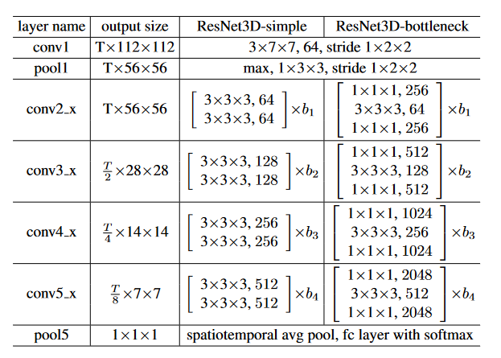

# Полезные ссылки по 3D Neural Network

## 1. Fast Algorithms for Convolutional Neural Networks

Author: `Andrew Lavin`, `Scott Gray`

- [Ссылка](https://arxiv.org/pdf/1509.09308.pdf)

## 2. Error Analysis and Improving the Accuracy of Winograd Convolution for Deep Neural Networks

Author: `ARBARA BARABASZ`, `ANDREW ANDERSON`, `KIRK M. SOODHALTER`, `DAVID GREGG`

- [Ссылка](https://arxiv.org/pdf/1803.10986.pdf)

Подробное описание получения матриц для перевода в домен Винограда.
Подробное описание точности 1d и 2d алгоритма винограда + предложения по улучшению

## 3. High Performance Implementation of 3D Convolutional Neural Networks on a GPU

- [Ссылка](https://www.hindawi.com/journals/cin/2017/8348671/)

Реализация conv winograd 3d и сравнение с cuDNN SGEMM, cuDNN FFT

## 4. A survey of accelerator architectures for 3D convolution neural networks

- [Ссылка](https://www.sciencedirect.com/science/article/pii/S1383762121000400)

## 5. FFT Convolutions are Faster than Winograd on Modern CPUs, Here’s Why

- [Ссылка](https://arxiv.org/pdf/1809.07851.pdf)

## 6. Deep Tensor Convolution on Multicores

- [Ссылка](https://arxiv.org/pdf/1611.06565.pdf)

--------------------------------------------------------------

# Анализ архитектур нейросетей для action/video classification

## 7. Learning Spatiotemporal Features with 3D Convolutional Networks (2015)

- [Ссылка](https://arxiv.org/pdf/1412.0767.pdf)

В статье анализируют предыдущие архитектуры для action classification и предлагают новую архитектуру C3D полностью основанная на 3D conv

### C3D
В данной статье предложили архитектуру C3D для action classification. Она показала результат лучше, чем 2D ConvNet + LSTM.

Выявили, что вариация 3x3x3 сверток показывает лучший результат.

input (CxDxHxW) | Op      | Filter | Stride
--------------- | ------- | ------ | ------
3x16x112x112    | Conv    | 3x3x3  | 1x1x1
:               | MaxPool | 1x2x2  | 1x2x2
64x16x56x56     | Conv    | 3x3x3  | 1x1x1
:               | MaxPool | 2x2x2  | 2x2x2
128x8x28x28     | Conv    | 3x3x3  | 1x1x1
256x8x28x28     | Conv    | 3x3x3  | 1x1x1
:               | MaxPool | 2x2x2  | 2x2x2
256x4x14x14     | Conv    | 3x3x3  | 1x1x1
512x4x14x14     | Conv    | 3x3x3  | 1x1x1
:               | MaxPool | 2x2x2  | 2x2x2
512x2x14x14     | Conv    | 3x3x3  | 1x1x1
512x2x14x14     | Conv    | 3x3x3  | 1x1x1
:               | MaxPool | 2x2x2  | 2x2x2
512x1x7x7       | FC      |        | 
:               | SoftMax |        | 

## 8. Quo Vadis, Action Recognition? A New Model and the Kinetics Dataset (2018)

- [Ссылка](https://arxiv.org/pdf/1705.07750.pdf)

В данной статье рассматриваются различные архитектуры нейронных сетей для классификации действий в видео и предлагают новую I3D. 

### 3D-Fused Two-Stream
Это расширение архитектуры Two-Stream архитектуры, где в качестве последних операцию используются 3D convolution (3x3x3 фильтр)

### Two-Stream I3D
В статье была предложена архитектура Two-Stream I3D, которая показала лучший результат по сравнению с прошлыми нейронными сетями для action classification.
В данной архитектуре используются свертки 7x7x7 stride 2, 1x1x1 stride 1, 3x3x3 stride 1.

input (CxDxHxW) | Op      | Filter | Stride
--------------- | ------- | ------ | ------
3x16x112x112    | Conv    | 7x7x7  | 2x2x2
:               | MaxPool | 1x3x3  | 1x2x2
16x56x56        | Conv    | 1x1x1  | 1x1x1
16x56x56        | Conv    | 3x3x3  | 1x1x1
:               | MaxPool | 1x3x3  | 1x2x2
16x28x28        | Inc (см. таблицу ниже)    | |
16x28x28        | Inc (см. таблицу ниже)    | |
:               | MaxPool | 3x3x3  | 2x2x2
8x14x14         | Inc (см. таблицу ниже)    | |
8x14x14         | Inc (см. таблицу ниже)    | |
8x14x14         | Inc (см. таблицу ниже)    | |
8x14x14         | Inc (см. таблицу ниже)    | |
8x14x14         | Inc (см. таблицу ниже)    | |
:               | MaxPool | 2x2x2  | 2x2x2
4x7x7           | Inc (см. таблицу ниже)    | |
4x7x7           | Inc (см. таблицу ниже)    | |
:               | AvgPool | 2x7x7  | 1x1x1

Операции в каждом слое Inception Module (Inc.) выполняются параллельно.

Prev layer to next layer  | Op         | Filter | Stride
---------                 | ---------- | ------ | ------
input -> 1.1              | Conv       | 1x1x1  | 1x1x1
input -> 1.2              | Conv       | 1x1x1  | 1x1x1
input -> 1.3              | MaxPool    | 1x1x1  | 1x1x1
input -> 2.1              | Conv       | 1x1x1  | 1x1x1
1.1 -> 2.2                | Conv       | 3x3x3  | 1x1x1
1.2 -> 2.3                | Conv       | 3x3x3  | 1x1x1
1.3 -> 2.4                | Conv       | 1x1x1  | 1x1x1
2.1, 2.2, 2.3, 2.4 -> out | Connection |        |

## 9. A Closer Look at Spatiotemporal Convolutions for Action Recognition (2018)
**Автор**: Facebook researches

- [Ссылка](https://openaccess.thecvf.com/content_cvpr_2018/papers/Tran_A_Closer_Look_CVPR_2018_paper.pdf)

В данной статье было предложено две архитектуры нейронных сетей для action recognition.

### MC (Mixed 2D-3D convolution)
В данной архитерктуре в начале используются слои с 3d conv для сохранения временной информации,
после чего используются 2d convolution.

Используются 3D conv: 3x7x7, stride 1x2x2, 3x3x3 stride 1

### R(2+1)D
В данной архитектуре 3D conv заменены на 2D conv для пространственных измерений и 1D conv для временного.

## 10. Video Classification with Channel-Separated Convolutional Networks (2019)
**Автор**: Facebook researches

- [Ссылка](https://arxiv.org/pdf/1904.02811.pdf)

В данной статье предлагают 2 новые архитектуры нейронных сетей для классфикации видео: ip-CSN (Interaction-Preserved Channel-Separated Network) и ir-CSN (Interaction-Reduced Channel-Separated Network). В данный момент ip-CSN-152 занимает первое место по точности классификации в [Sports-1M benchmark](https://paperswithcode.com/sota/action-recognition-in-videos-on-sports-1m) и 6-ое в [Kinetics-400 benchmark](https://paperswithcode.com/sota/action-classification-on-kinetics-400)

Они строятся на базе архитектуры ResNet3D-bottleneck (это модификация ResNet3D, где два слоя 3x3x3 заменяются на conv 1x1x1 -> conv 3x3x3 -> conv 1x1x1)

> ip-CSN предполагает замену операции conv 3x3x3 на две операции: conv 1x1x1 -> depthwise conv 3x3x3

> ir-CSN предполагает замену операции conv 3x3x3 на операцию: depthwise conv 3x3x3

ResNet3D layer | ResNet3D-bottleneck layer | ip-CSN layer           | ir-CSN layer
-------------- | ------------------------- | ------------           | ------------
conv 3x3x3     | conv 1x1x1                | conv 1x1x1             | conv 1x1x1
conv 3x3x3     | conv 3x3x3                | conv 1x1x1             | depthwise conv 3x3x3
--             | conv 1x1x1                | depthwise conv 3x3x3   | conv 1x1x1
--             | --                        | conv 1x1x1             | --

